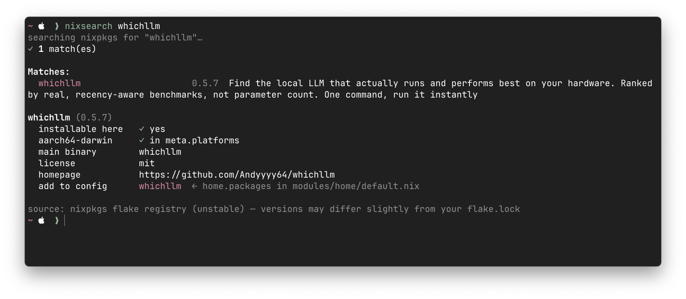

# nixsearch

`nixsearch` searches nixpkgs and shows whether matching packages are available
for Apple Silicon Darwin.



## Usage

Run directly from GitHub:

```sh
nix run github:kaitoimai/nixsearch -- ripgrep
```

Install into a profile:

```sh
nix profile install github:kaitoimai/nixsearch
```

Then run:

```sh
nixsearch ripgrep
```

## nix-darwin

Add this repository as a flake input:

```nix
inputs.nixsearch.url = "github:kaitoimai/nixsearch";
```

Pass it to Home Manager:

```nix
home-manager.extraSpecialArgs = {
  inherit nixsearch;
};
```

Install the package:

```nix
{
  pkgs,
  nixsearch,
  ...
}: {
  home.packages = [
    nixsearch.packages.${pkgs.system}.default
  ];
}
```

## Development

```sh
nix develop
go test ./...
nix fmt
nix flake check
```
